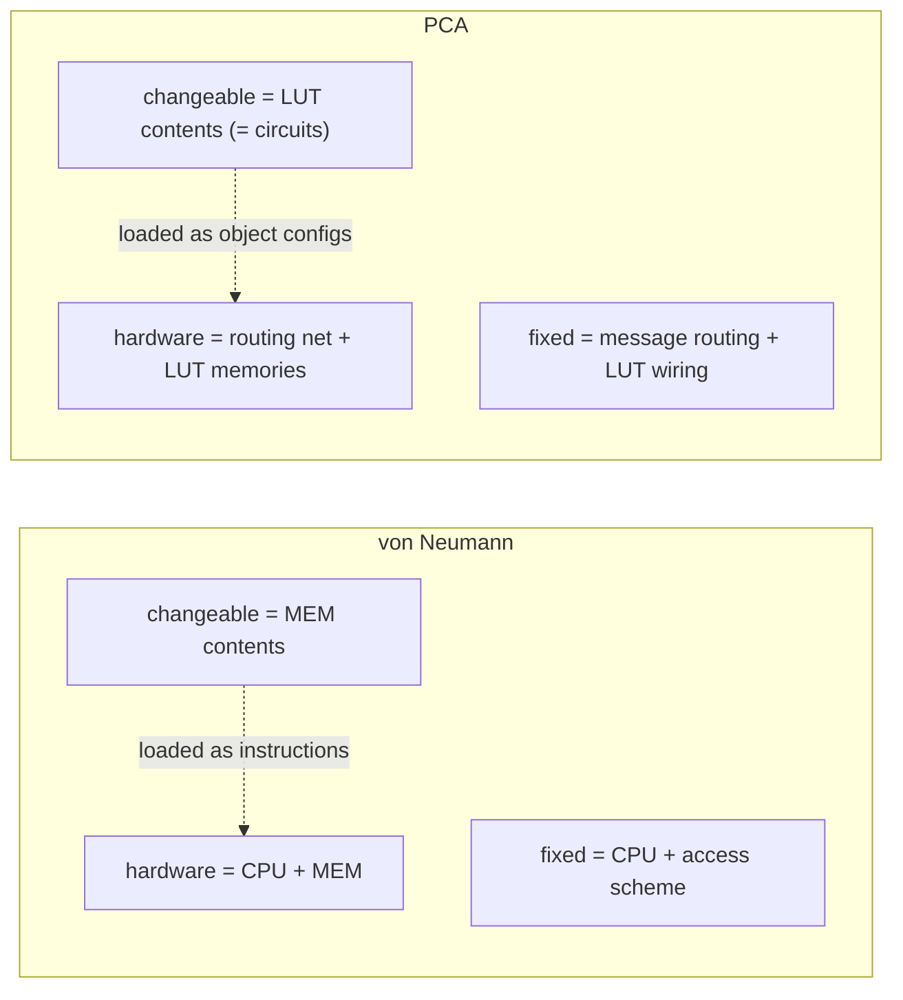
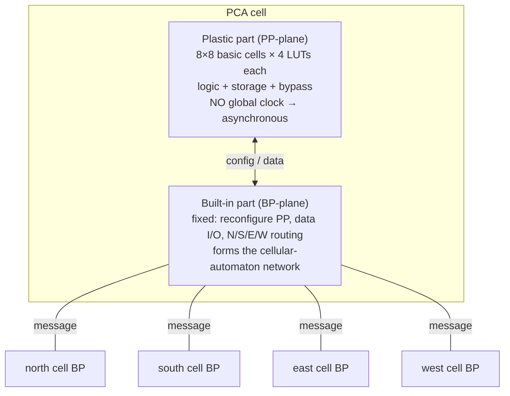
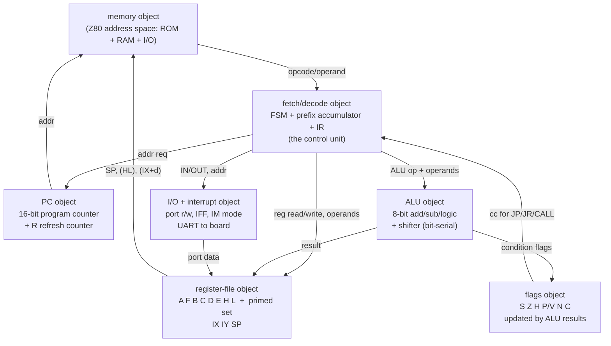
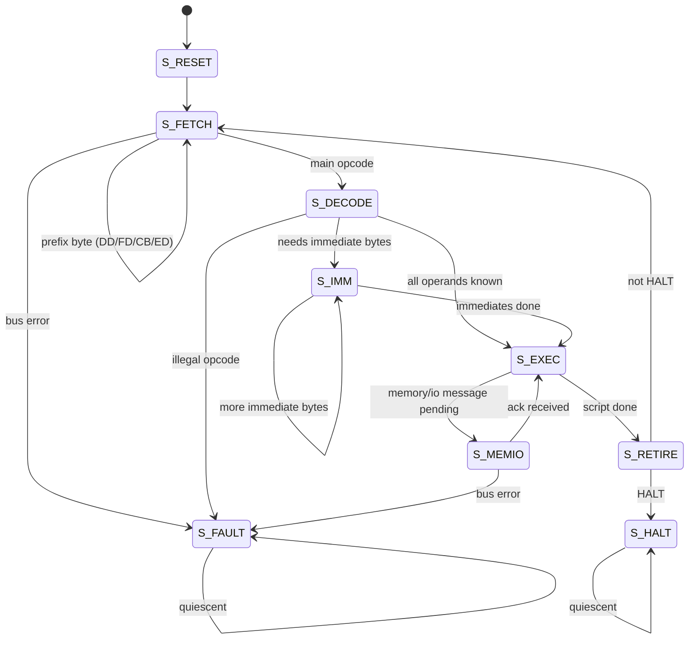
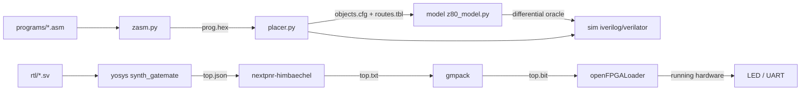

# PCA-Z80 System Intern Onboarding Guide

## 0. How to read this guide

This guide is written for a new engineer who can read SystemVerilog and Python,
can use a shell, Make, and Git, but has never seen Plastic Cell Architecture
(PCA) or this project. It explains **what PCA is**, **why a Z80 is a good thing
to build on it**, **how the Z80 is decomposed into PCA objects**, and **how every
part of the system fits** — from the LUT cell up to a bitstream blinking an LED
on the board. Each section builds on the previous one. The guide moves from the
big idea, down into the cell and the Z80 datapath, and back up to the board.

After reading this guide, an intern should be able to:

- explain what PCA is and how it differs from a conventional FPGA or a
  software CPU emulator;
- locate every planned part of the system in the repository and explain its
  role;
- describe how a Z80 instruction becomes a sequence of object messages on the
  PCA mesh;
- run the tests and the build, and read the evidence they produce;
- place a Z80 object graph on the GateMate and explain the area/time budget;
- identify the contracts that keep the model, the placer, and the RTL
  consistent, and the bugs those contracts prevent.

This is a **design and implementation guide**, not yet a build log. The repo
skeleton and RTL are produced by the phased plan in §13; until then, file
references name the *planned* layout (`pca_z80/...`), clearly distinguished
from the already-existing `sources/` and `ttmp/` trees.

## 1. What we are building, and why

We are building a **Z80 8-bit microprocessor whose components are wired-logic
"objects" laid out on a Plastic Cell Architecture (PCA) mesh**, and deploying
that mesh on the **Olimex GateMateA1-EVB** FPGA (Cologne Chip CCGM1A1) using
only open-source tools. There is no hidden soft-CPU core and no software
interpreter: the Z80's registers, ALU, flags, and control unit are *configured
circuits* sitting in reconfigurable LUT cells, and they talk to each other by
passing messages through a fixed cellular-automaton routing network. That is
the defining property of PCA, and it is the reason this project is interesting
rather than "yet another Z80 soft core."

### 1.1 What PCA is, in one paragraph

PCA is a dynamically reconfigurable hardware computer proposed at NTT in 1998
(Nagami, Oguri, et al.) and continued at Nagasaki University (Oguri Lab). Its
silicon is a large 2-D mesh of identical **cells**. Every cell has two parts: a
**plastic part** — a small "sea of LUTs" (look-up tables) that you reconfigure
to hold a piece of a circuit or some data — and a **built-in part** — fixed
logic that reconfigures the plastic part, moves data in and out of it, and
routes messages to neighboring cells. The built-in parts together form a
**cellular automaton**; the plastic parts together form a reconfigurable
**FPGA-like fabric**. A configured circuit living in a cluster of plastic
parts is called an **object**, and objects are generated, deleted, and wired
together *at runtime* by sending messages through the built-in network.

The founding paper states the idea that makes this project possible:

> "A von Neumann architecture is obtained if only one cell part is extracted.
> The memory corresponds to the plastic part and the built-in part can be
> compared with a mini CPU engine."
> — Nakada et al., *Plastic Cell Architecture: A Dynamically Reconfigurable
> Hardware-based Computer*, IPPS/SPDP'99 (Springer LNCS 1586), §5.

A Z80 *is* a von-Neumann-style CPU (PC + IR + decode + datapath + memory
interface). Building it on PCA is therefore the canonical "implement a
processor as wired logic on PCA" exercise: each Z80 subsystem becomes an
object on the mesh, and the built-in network is the CPU's internal bus.

### 1.2 Why build it this way (and not just a soft core)

A normal "Z80 soft core" is written in Verilog, synthesized to the FPGA's LUTs
and flip-flops as one big clocked netlist, and that is the end of the story.
PCA-Z80 is different in three load-bearing ways:

- **Object-oriented hardware.** The Z80 is split into named, independently
  placeable objects (register file, ALU, flags, decoder/FSM, memory
  interface). Each object is a self-contained wired-logic circuit. This mirrors
  how the Z80 was *designed* (discrete functional blocks) and makes the
  architecture legible.
- **Message-passing, not a shared bus.** Objects communicate by sending
  packets through the built-in routing network, not by driving a shared
  tristate bus. This is the PCA model from the founding paper (§2.2), and it
  is what makes the design **asynchronous and dynamically reconfigurable**:
  you can add or remove an object without retiming a global clock.
- **Reconfigurable by construction.** Because objects are placed by loading
  their configuration into plastic parts, the same hardware can grow a new
  object at runtime (e.g. instantiate an alternate register bank for `EXX`).
  The baseline places objects statically; dynamic placement is a phased
  extension (§13, Phase 7).

The learning objective is the same as the sibling MATE-16 project: understand
the *whole* machine, not a slice of it — but here the "machine" is a
reconfigurable object graph, which is a genuinely different mental model from
a fixed netlist.

### 1.3 Scope of the baseline

The baseline is a **statically placed, cycle-accurate-enough Z80 object graph**
that runs real Z80 machine code and demonstrates it on the board (an LED
controlled by Z80 `OUT` instructions, and UART output). Dynamic reconfiguration
and a bit-exact undocumented-opcode model are **extensions**, not prerequisites.
See §13 for the exact phase boundaries.

| In scope (baseline) | Out of scope (extensions, Phase 7) |
|---|---|
| PCA cell RTL (plastic part + built-in part) | Runtime pressure-based object placement |
| Z80 as a static graph of PCA objects | Multi-context / partial reconfiguration |
| Core Z80 instruction set (see §5 table) | Undocumented/edge opcode bit-exactness |
| Bit-serial datapath option (§8) | Full bit-parallel datapath timing closure |
| Async four-cycle handshakes between objects | Interrupts (IM 0/1/2) — partial baseline |
| Assembler + reference model + differential tests | DMA, refresh-cycle-accurate bus timing |
| GateMate place-and-route, LED + UART demo | VGA / PS2 / external PSRAM |

## 2. The twice-double structure (the conceptual frame)

Before any hardware, an intern must internalize the conceptual move that PCA
makes relative to von Neumann. The Oguri Lab states it as the **"twice double
structures of general-purpose computing"** (see `sources/SOURCES.md`):

- **von Neumann:** hardware = CPU + MEM; *software* = program logic. The
  **changeable** part of the hardware is the *contents of MEM*; the **fixed**
  part is the *CPU + the MEM-access scheme*. You change what the machine does
  by changing memory contents, not the silicon.
- **PCA:** hardware = PCA (a routing network + many small LUT memories);
  *software* = **wired logic** (configured circuits). The **changeable** part
  of the hardware is the *contents of the many small LUT memories*; the
  **fixed** part is the *message-routing network + the connections that form
  LUT-based logic*. You change what the machine does by **loading new circuit
  configurations into LUTs**, not by running a new program on a fixed CPU.

The deep payoff: in PCA, "software" is a circuit, and "running a program" is
**generating, connecting, and deleting hardware objects**. A Z80 on PCA is a
*fixed* program (the Z80 never reconfigures itself in the baseline) — but it
is expressed as a graph of objects, so the *mechanism* for dynamism is present
even when unused. This is the whole point of choosing PCA: the architecture is
built for dynamic wired logic, and we exercise the static subset first.



## 3. The PCA cell — the atom of the machine

Everything is built from one repeated tile: the **PCA cell**. You must
understand it precisely; the rest of the guide refers back to it constantly.

### 3.1 The dual structure (paper 01 §2.1; paper 02b §2.1)

A cell has two planes, both on the same die, both tiled across the 2-D mesh:

- **Plastic part (PP-plane)** — the *variable* part. A **sea of LUTs**: per the
  EUC papers, an **8×8 array of basic cells**, and each **basic cell = four
  4-input / 1-output LUTs** (a 16-entry truth table each, i.e. a "16-bit LUT")
  plus local wires. There are **no dedicated flip-flops and no global clock**:
  - any combinational logic is a LUT;
  - a flip-flop is a LUT **looped back on itself** (a latch formed by feedback);
  - data storage is a LUT used as a small memory;
  - a "bypass" wires one plastic part straight to a neighbor.
  Because there is no global clock, **all logic on the plastic part is
  asynchronous**.
- **Built-in part (BP-plane)** — the *fixed* part. Its functions are exactly
  three (paper 01 §2.1):
  1. **reconfigure** the plastic part (load a new truth table / wiring);
  2. **data I/O** to and from the plastic part;
  3. **route messages** to/from the four neighboring built-in parts (N/S/E/W).



### 3.2 What a plastic part can do (paper 01 §2.3, Fig. 5)

With only LUTs and wires, a plastic part realizes:

- **Combinational logic** — any boolean function of up to 4 inputs per LUT;
  chain LUTs for wider functions.
- **Storage** — a LUT addressed by its own feedback lines is a small RAM;
  this is how the Z80 register file and flags live in the plastic part.
- **Branch / transfer** — LUTs wired to fan a signal out to multiple
  neighbors, or to pass it straight through (bypass).
- **A flip-flop** — a LUT whose output feeds its own input through a delay;
  this is how *sequential* state (PC, IR latches, control FSM state) is held
  without a dedicated flop primitive.

The cost: a plastic-part flip-flop is larger and slower than a dedicated FF,
and it is asynchronous. This is the root of the **bit-serial datapath**
decision in §8.

### 3.3 The built-in part as a cellular automaton (paper 01 §2.1)

The built-in parts of all cells form a **network of cellular automata**: a
collection of identical state machines that exchange information with their
neighbors by a simple, fixed set of rules. The "rules" are the **message
protocol** of §4. This is why PCA is *homogeneous and non-hierarchical* — the
same cell is used at the chip edge and in the middle, and the same protocol
works across a chip boundary (paper 01 §4.2: multi-chip systems have pins only
between built-in parts, and communication is asynchronous and multiplexed).

## 4. Objects, generation, and message passing

PCA is not "an FPGA you reconfigure once." It is a system where **circuits are
objects with a lifecycle**. This section is the heart of the architecture.

### 4.1 What an object is (paper 01 §2.2; paper 02b §2.1)

An **object** is a processing module made of one or more plastic parts,
realized as **wired logic**. Objects are arranged to correspond to a **Data
Flow Diagram**: each object performs one operation (add, compare, decode,
register access), and data flows between objects along the message network.
A Z80 is decomposed into exactly such a DFG — see §6.

### 4.2 The object lifecycle (paper 01 §2.2)

To dynamically allocate a new object, the built-in network performs:

1. **Search & reserve** free area on the mesh.
2. **Generate** the object by injecting its behavior (configuration bits) into
   the plastic parts of the reserved cells.
3. **Enable** the new object for runtime operation.
4. **Open** the communication path between the built-in and plastic parts so
   messages can flow.
5. **Operate** — the object runs as a circuit and exchanges messages.
6. **Release** — on a release message, the area is freed for new allocation.

Objects have a **mother–child relationship**: only the object that created a
child can send the release message that frees it. This prevents orphaned
circuits and makes reclamation deterministic.

### 4.3 Messages: packets, routing, async handshake (paper 01 §2.2; paper 02b §2.1)

Communication is **message passing through built-in parts**, with **exact
(static) routing** — not adaptive. A message is a variable-length **packet**
with three frame types:

```text
+-------------------+--------------------------------+-------------+
| routing command   | payload: config command + data | trailer     |
| (N/S/E/W hops)    | (what to load / what to send)  | (clear/end) |
+-------------------+--------------------------------+-------------+
```

The built-in part processes the routing frames to move the packet across the
mesh; the payload reaches the destination plastic part, which either loads a
new configuration or exchanges data. PCA uses an **asynchronous bundled
protocol with four-cycle signaling** (paper 02b §2.1):

```mermaid
sequenceDiagram
    participant R as Requester object
    participant B as Built-in network
    participant T as Target object
    R->>B: assert req (data stable)
    B->>T: route packet to target cell
    T->>B: assert ack (data accepted / latched)
    B->>R: forward ack
    R->>B: deassert req
    B->>T: deassert ack
    Note over R,T: one transaction complete; only one outstanding per object
```

This is the PCA analogue of the **held-request** bus the sibling MATE-16
project uses (see `../2026-08-25--vm-cpu-gatemate/mate16/rtl/mate16_core.sv`):
`req` is held stable until `ack`; the requester deasserts the cycle after
`ack`; exactly one transaction is outstanding at a time. The famous MATE-16
"**doubled side effect**" bug (a target re-accepting a held request) applies
verbatim here: a built-in part must capture a packet's operands once and
strobe its side effect from a single acceptance edge, never from `req` itself.

### 4.4 Area management = "pressure" (papers 02b, 05)

PCA needs a hardware analogue of `malloc`/`new` so objects can grow at runtime,
but a central "domain administrator" serializes parallel objects and risks
deadlock. The **pressure** method (paper 02b §3): when object *B* needs a new
object *B′*, *B* broadcasts a **pressure command** to its neighbors; neighbors
**slide to vacant cells**, then *B* materializes *B′* in the freed space. It
runs independently in many places at once — no administrator. The pressure
built-in cell has **five ports (N/S/E/W + feedback)**, a state machine
(vacant / circuit / receiving-pressure), and a switch to limit accepted input
directions; it uses **wormhole, no-wait (non-blocking) issue** to avoid
deadlock, accepting that commands may be overwritten rather than stall
(paper 02b §4). Measured cost of a space-allocation cell (paper 05): **200
gates/cell, 3.55 ns max delay/cell, 306.3 µW for a 3×3 block running six
pressure commands.**

The **baseline places objects statically** (Phase 1–6), so pressure is not
exercised; it is documented here because it is the mechanism that makes PCA
*reconfigurable*, and Phase 7 turns it on.

## 5. The Z80 — what we are mapping

PCA is the substrate; the Z80 is the program we map onto it. This section is a
focused recap of the Z80, scoped to what the PCA mapping needs. It is not a
full Z80 manual.

### 5.1 Architectural state

The Z80 is an 8-bit CPU with a 16-bit address space. Its programmer-visible
state:

| Register(s) | Width | Role |
|---|---|---|
| `A` / `F` | 8 + 8 | accumulator / flags (S Z F5 H F3 P/V N C) |
| `B C D E H L` | 8 each | general regs; `BC`/`DE`/`HL` are 16-bit pairs |
| `A' F' B' C' D' E' H' L'` | 8 each | alternate register set (swap with `EXX`/`EX AF,AF'`) |
| `IX` / `IY` | 16 | index registers (with signed 8-bit displacement `d`) |
| `SP` | 16 | stack pointer |
| `PC` | 16 | program counter |
| `I` | 8 | interrupt-vector base |
| `R` | 7 | refresh counter |

Flag bits (F): `S`(7) sign, `Z`(6) zero, `H`(4) half-carry, `P/V`(2)
parity/overflow, `N`(1) add/subtract, `C`(0) carry; bits 5 and 3 are
undocumented copies of internal state.

### 5.2 Instruction groups (what the object graph must support)

| Group | Examples | Notes |
|---|---|---|
| Load/store | `LD r,r'` `LD r,n` `LD r,(HL)` `LD (nn),A` `LD r,(IX+d)` | the bulk of execution; register file + memory object |
| 8-bit ALU | `ADD` `ADC` `SUB` `SBC` `AND` `OR` `XOR` `CP` `INC` `DEC` | ALU object + flags object |
| 16-bit ALU | `ADD HL,rr` `INC rr` `DEC rr` | 16-bit adder on register pairs |
| Rotates/shifts | `RLCA` `RRCA` `RLA` `RRA` `RLC` `RRC` `RL` `RR` `SLA` `SRA` `SRL` `SLL` | shifter object (CB-prefixed) |
| Bit ops | `BIT` `SET` `RES` | CB-prefixed |
| Control | `JP` `JP cc` `JR` `JR cc` `DJNZ` `CALL` `RET` `RETI` `RETN` `RST` | PC/SP object + decoder/FSM |
| Stack | `PUSH` `POP` | SP object + memory object |
| Exchange | `EX` `EXX` | register-file object (alternate set) |
| Block | `LDI` `LDIR` `LDD` `LDDR` `CPI` `CPIR` `CPD` `CPDR` | ED-prefixed loops |
| I/O | `IN` `OUT` `INI` `INIR` `IND` `INDR` `OTI` `OTIR` `OTD` `OTDR` | memory/io object |
| Misc | `NOP` `HALT` `DI` `EI` `IM 0/1/2` `LD A,I` `LD A,R` | decoder/FSM + IFF/IM latches |

### 5.3 Encoding and prefixes

Opcodes are 1–4 bytes. The first byte selects a group; four **prefix bytes**
extend the space:

- `CB` — bit/shift/rotate on `r` or `(HL)`/`(IX+d)`/`(IY+d)`.
- `ED` — extended (block, 16-bit `LD`, I/O, `IM`, `LD A,I/R`, `NEG`, etc.).
- `DD` / `FD` — use `IX` / `IY` instead of `HL` for the following instruction
  (and `DD CB`/`FD CB` for indexed bit ops).

A fetch therefore peeks bytes and **accumulates prefixes** before committing to
a decode — this is the central complication of the Z80 decoder object (§6.4,
§7.3).

## 6. Mapping the Z80 onto PCA — the object graph

This is the design's core idea: turn the Z80 into a **Data Flow Graph of
objects**, each living in a cluster of PCA cells, connected by the built-in
message network. The mapping is not arbitrary — it follows the Z80's own
functional decomposition and the PCA "object = DFG node" rule (paper 02b).

### 6.1 The object graph at a glance



Each box is one object (a cluster of PCA cells). Arrows are **messages** on the
built-in network. Note how the Z80's natural dataflow (fetch → decode → read
regs → ALU → writeback; flags feed back to the control) maps directly onto
object-to-object messages.

### 6.2 Why these objects (and not fewer/more)

- **One object per Z80 functional unit** keeps each object small (fits a
  handful of cells) and independently testable — the verification pyramid
  (§10) gets a clean unit-test layer per object.
- **Memory is an object**, not a background bus, because in PCA *everything*
  is reached by message: a `LD (HL),A` is the register object sending an
  address + data message to the memory object.
- **Flags are a separate object** because they are read by the control unit
  (for conditional jumps) *and* written by the ALU — a classic DFG node with
  two producers/consumers.
- **Fetch/decode is the control object** — it drives the others by sending
  messages. This object holds the FSM, the prefix accumulator, and the IR. It
  is the PCA analogue of the built-in part's "mini CPU engine" from the
  founding quote in §1.

### 6.3 The "one cell = CPU + MEM" analogy realized

The founding paper says one isolated cell is a CPU+MEM pair: the plastic part
is the memory, the built-in part is a mini CPU. The Z80 object graph *reifies*
this at the system level: the **memory object** is plastic parts used as
storage (LUT-RAM); the **fetch/decode object** is a built-in part driving
reconfiguration and message routing. The whole Z80 is then "many such pairs,
wired by messages" — exactly the PCA thesis.

### 6.4 Object-to-Z80-subsystem table (planned file map)

| Z80 subsystem | Object | Planned RTL file | Plastic-part content |
|---|---|---|---|
| Program counter + refresh | `pc` | `pca_z80/rtl/obj_pc.sv` | PC reg (LUT feedback), R counter |
| Fetch + decode + FSM | `decode` | `pca_z80/rtl/obj_decode.sv` | IR latch, prefix state, FSM (PLA) |
| Register file + alt set + IX/IY/SP | `regfile` | `pca_z80/rtl/obj_regfile.sv` | LUT-RAM for 8-bit regs + 16-bit regs |
| 8-bit ALU + shifter | `alu` | `pca_z80/rtl/obj_alu.sv` | bit-serial adder/logic + shifter |
| Flags | `flags` | `pca_z80/rtl/obj_flags.sv` | flag latches + flag-compute LUTs |
| Memory + I/O + interrupt | `memio` | `pca_z80/rtl/obj_memio.sv` | ROM/RAM LUT-RAM, port regs, IFF/IM |
| PCA cell (substrate) | `cell` | `pca_z80/rtl/pca_cell.sv` | plastic part + built-in part |
| Built-in router | `router` | `pca_z80/rtl/pca_router.sv` | N/S/E/W + feedback, message FSM |
| Top / mesh | `mesh` | `pca_z80/rtl/pca_mesh.sv` | cell array + object placement |

## 7. The control object — fetch, decode, execute as messages

The Z80 is fundamentally a **fetch-decode-execute** loop. On PCA this loop is a
sequence of messages issued by the decode object. This is the single most
important section for understanding "how a Z80 instruction runs here."

### 7.1 The fetch-decode-execute cycle (pseudocode)

```pseudo
# decode object — runs the Z80, one instruction per outer loop
forever:
    # ---- FETCH (1–4 bytes, accumulating prefixes) ----
    prefix = NONE
    loop:
        (addr) = PC.read()                 # message to pc object
        (byte, ok) = MEM.read(addr)         # message to memio object
        if not ok: fault(BUS); break
        PC.inc(1); R.inc_low(1)
        if   byte in {DD, FD}: prefix = IX/IY(byte); continue   # consume prefix
        elif byte == CB:      prefix = CB;  continue
        elif byte == ED:       prefix = ED;  continue
        else: opcode = byte; break          # main opcode found
    IR = opcode

    # ---- DECODE (PLA lookup; picks the execute script) ----
    script = DECODE_PLA(IR, prefix)         # combinational LUT table
    if script is ILLEGAL: fault(ILLEGAL); break

    # ---- EXECUTE (send the messages the script lists) ----
    operands = []
    for b in script.immediate_bytes:
        (addr) = PC.read()
        (byte, ok) = MEM.read(addr); if not ok: fault(BUS); break
        operands.append(byte); PC.inc(1); R.inc_low(1)
    run(script, operands)                   # issues reg/alu/flags/mem/io msgs

    # ---- RETIRE ----
    instruction_count += 1                   # only on success (MATE-16 rule)
    if script == HALT: enter HALT            # quiescent; no more fetches
```

Compare this to the MATE-16 core's `S_FETCH → S_DECODE → S_EXEC_*` FSM
(`../2026-08-25--vm-cpu-gatemate/mate16/rtl/mate16_core.sv`): the *structure*
is the same (fetch, decode, immediate-fetch, execute, retire), but here each
step is an **object message** rather than a state in a single module's FSM.

### 7.2 The prefix problem and why decode is its own object

The Z80 fetches 1–4 bytes per instruction and the meaning of the *main* opcode
depends on which prefixes preceded it (e.g. `DD 7E d` = `LD A,(IX+d)`). The
decode object therefore owns a small **prefix-accumulator state machine**
before the main PLA. This is also where `CB`/`ED` re-route to a second-level
decode PLA. Keeping this in one object means the FSM state (the plastic-part
LUT feedback) is localized, and only the *decoded script* leaves the object as
messages.

### 7.3 The decode FSM (PLA object)

The control unit is the textbook "compact finite state machine" that paper 01
§3 route (c) calls out as ideal for the **PLA / sum-of-products** mapping: an
SOP-synthesized, relocatable PLA embedded in plastic-part LUTs. The states:



`S_FETCH` issues a `PC.read` then a `MEM.read`; on `ack` it latches the byte,
increments PC and R, and either accumulates a prefix or advances to
`S_DECODE`. `S_DECODE` runs the PLA (a LUT lookup) to choose the execute
script. `S_IMM` fetches further immediate bytes. `S_EXEC` issues the script's
object messages, waiting in `S_MEMIO` for each ack. `S_RETIRE` increments the
instruction count and loops (or halts). `S_FAULT` is quiescent and records
`fault_pc` = the opcode address (the precise-fault rule from MATE-16,
§7 of the sibling guide).

## 8. The datapath — bit-serial on the plastic part

The plastic part has no dedicated flip-flops and no global clock, so a
wide bit-parallel datapath is expensive (each bit of state is a LUT looped
back). The literature's answer is **Bit Serial PCA** (paper 02b §2.2): each
plastic part operates as a **state machine + shift register**, processing one
bit at a time, communicating through the built-in part. This keeps circuits
compact and is the natural fit for PCA's reconfiguration switches living in
the wiring.

### 8.1 Bit-serial vs bit-parallel — the tradeoff

| | Bit-serial (baseline) | Bit-parallel (extension) |
|---|---|---|
| Per-bit logic | one LUT column, shift register | 8 parallel LUT columns |
| State cost | 1 LUT-flop per bit in flight | 8 LUT-flops per register |
| Throughput | ~8 cycles/8-bit op | ~1 cycle/8-bit op |
| Cell count for ALU | small (a few cells) | large (8× the columns) |
| Fit on CCGM1A1 (~40k LUTs) | comfortable | tight for full Z80 |
| Clocking | async handshake per bit | still async, wider bundles |

The baseline uses **bit-serial** so the whole Z80 object graph fits the
GateMate with margin, matching the sibling project's "~9% of the CCGM1A1" result
but for a more complex CPU. A full bit-parallel datapath is a Phase 7
extension gated on timing closure.

### 8.2 A bit-serial 8-bit adder (the ALU object's core)

A ripple adder processes one bit per handshake. For bit `i`:

```pseudo
# ALU object — bit-serial full adder, one bit per ack
inputs: a[8], b[8], cin          # operands arrive as serial streams LSB-first
state:  carry = cin
for i in 0..7:
    sum_i   = a[i] XOR b[i] XOR carry
    carry   = (a[i] AND b[i]) OR (carry AND (a[i] XOR b[i]))
    send(sum_i)                    # one result bit back to regfile object
ack from regfile; advance to next bit
final carry -> flags object (C flag)
```

The same LUT column does `AND/OR/XOR/ADD/SUB` by changing its truth table
(the plastic part is *reconfigurable*: the decode object sends a "load ALU
op" message before the data). Subtraction reuses the adder with `B` inverted
and carry-in = 1 (the standard Z80 trick; sets the `N` flag). Shifts/rotates
are the same shifter with a different feedback wiring.

### 8.3 The register file as LUT-RAM

The register file object stores `A F B C D E H L` (and the primed alternates,
`IX IY SP`) in **LUT-RAM**: plastic-part LUTs addressed by a register-select
field, returning the stored 8-bit value. A read is a message with the
register-select; a write is a message with select + data. The alternate set is
a second LUT-RAM bank swapped by `EXX`/`EX AF,AF'`. This is exactly the
founding paper's "plastic part can organize the memory object for data
storage" (§2.1).

## 9. The PCA-cell and router RTL (the substrate)

The objects above are *what runs*; this section is *what they run on* — the
PCA cell and the built-in router that implement the mesh. These are the only
"substrate" modules; everything Z80-specific is an object's configuration.

### 9.1 The PCA cell (`pca_z80/rtl/pca_cell.sv`, planned)

```systemverilog
module pca_cell #(parameter COLS=8, ROWS=8) (
    input  logic clk,         // only for the synchronous FPGA wrapper; objects are async
    // built-in part: 4-neighbor message ports (held-request/ack each)
    output msg_t  n_out, s_out, e_out, w_out,
    input  msg_t  n_in,  s_in,  e_in,  w_in,
    // plastic part: configuration + data I/O (driven by the built-in part)
    output cfg_t  pp_cfg,      // truth tables + wiring for this cell's plastic part
    output pp_data_t pp_wdata,
    input  pp_data_t pp_rdata,
    // status to neighbors / host
    output cell_stat_t stat
);
    // built-in part: a small FSM that routes packets and reconfigures the PP
    // plastic part: 8x8 basic cells of 4x 4-LUT, inferred as LUT memory
endmodule
```

The module separates the **built-in part** (a routing/reconfiguration FSM) from
the **plastic part** (LUT-RAM inferred from a memory array), mirroring paper
01's datapath/control split. On a clocked FPGA we model the asynchronous
plastic-part logic with a single `clk` for simulation/synthesis convenience,
but the **object-to-object protocol stays a held-request/ack handshake**
(§4.3) — no combinational path spans objects, so timing closes like the
MATE-16 design.

### 9.2 The built-in router (`pca_z80/rtl/pca_router.sv`, planned)

The router is the cellular-automaton node: it has **five ports (N/S/E/W +
feedback)** and a **state machine** (vacant / carrying-circuit /
receiving-message), and it applies the message protocol of §4.3. For the
baseline (static placement) it does **exact routing** along a precomputed path
per object-pair — no pressure, no wormhole, no overwrites. The pressure
extension (Phase 7) adds the command sets of papers 02b/05.

```pseudo
# router — exact routing, one outstanding transaction per port
on req from a port P with packet pkt:
    if pkt.routing == EMPTY:           # this cell is the destination
        deliver pkt.payload to local plastic part / object
        ack P
    else:
        next_port = pkt.routing[0]      # N/S/E/W
        forward (pkt with routing[1..]) to next_port
        when next_port acks: ack P
never accept a second req on P until P's ack cycle completes   # MATE-16 anti-double rule
```

### 9.3 The mesh and object placement (`pca_z80/rtl/pca_mesh.sv`, planned)

`pca_mesh.sv` instantiates an `R×C` array of `pca_cell` and wires the
neighbor ports. **Placement** is a build-time mapping from each Z80 object
(§6.4) to a rectangular region of cells, produced by the placer tool (§11.3).
The baseline placement is static and known at synthesis time, so the router
paths are also static — the placer emits both the object configurations *and*
the routing tables.

## 10. Verification — the reference model is the oracle

Following the sibling MATE-16 discipline ("write the model before the RTL;
debug RTL against an independent oracle"), the Z80 reference model is the
**first** implementation, and RTL is tested against it.

### 10.1 The Z80 reference model (`pca_z80/tools/z80_model.py`, planned)

A pure-Python, instruction-accurate Z80 that implements every baseline opcode,
flag rule, and the prefix logic. It is *not* a line-for-line copy of the RTL —
it is an independent oracle (the MATE-16 `model16.py` pattern, see
`../2026-08-25--vm-cpu-gatemate/mate16/tools/model16.py`).

```python
from z80_model import Z80, BusTarget

class Z80:
    # architecturally visible state
    A=F=B=C=D=E=H=L=0; Ap=Fp=Bp=Cp=Dp=Ep=Hp=Lp=0
    IX=IY=SP=PC=0; I=R=0; IFF1=IFF2=0; IM=0; halted=False; instruction_count=0

    def __init__(self, program: bytes, ram_words=65536, io: BusTarget):
        self.mem = bytearray(ram_words); self.mem[:len(program)] = program
        self.io = io

    def step(self) -> int:        # retire exactly one instruction; return cycles
        ...                        # fetch with prefix accumulation, decode, execute

    def run(self, max_steps=10_000_000):  # loop to HALT/fault
        while not self.halted and self.instruction_count < max_steps:
            self.step()
        return self.instruction_count
```

`step()` retires exactly one instruction or faults; it obeys the precise-fault
rule (no partial architectural update on a bus error — the MATE-16 invariant).

### 10.2 The verification pyramid

| Layer | Count (target) | Oracle | Speed |
|---|---:|---|---|
| Pure software unit (model opcodes, flags, prefix logic) | ~400 | explicit values | <1 s |
| Per-object RTL (pc, regfile, alu, flags, memio, router, cell) | ~80 | model slices | s |
| Differential (RTL object graph vs `z80_model.py`) | ~60 | reference model | min |
| System (assembled Z80 → mesh → LED/UART) | ~10 | model + signatures | min |
| Synthesis/timing | 1 | reports + log gate | min |
| Hardware (Z80 `OUT` blinks LED; UART emits) | 1 | observation | human |

The fast suites are toolchain-independent and run constantly; the
differential suite compares retired RTL state to `z80_model.py` with recorded
random seeds, exactly as MATE-16's `test_core_directed.py` did against
`model16.py`.

### 10.3 What "done" means (disprovable claims)

The baseline is done when: the model passes the unit suite; each object passes
its directed tests; the differential suite shows zero divergence vs the
model; the mesh synthesizes and meets 10 MHz with positive slack; and the
board shows a Z80 program (assembled by our assembler) blinking the LED and
emitting over UART. Each claim is backed by a saved artifact (log, VCD, report,
photo).

## 11. The software tools

### 11.1 The assembler (`pca_z80/tools/zasm.py`, planned)

A two-pass Z80 assembler (no `eval`, the MATE-16 `asm16.py` safety rule) that
emits a flat memory image plus a symbol table and a listing. It handles the
prefix encoding, the four prefix families, and the displacement `d` for
`IX/IY`. Outputs: `prog.hex` (`$readmemh`), `prog.bin`, `prog.lst`,
`prog.sym.json`.

```bash
python3 tools/zasm.py programs/blink.asm -o build -n blink
```

### 11.2 The disassembler / decoder tester (`pca_z80/tools/zdis.py`, planned)

Round-trips the assembler against the model's decoder and produces a
human-readable trace of object messages per instruction — the debug view an
intern uses to see *which messages* a `LD (HL),A` becomes.

### 11.3 The object-graph placer (`pca_z80/tools/placer.py`, planned)

Maps each Z80 object to a rectangular cell region and emits:

- **object configurations** — the plastic-part truth tables / wiring per
  object (loaded at reset via the built-in network);
- **routing tables** — the exact static paths between object pairs (paper 01
  §2.2 "exact routing");
- a **placement report** — cells used per object, total cells, and an
  estimated critical path from the 3.55 ns/cell figure (paper 05).

This is the PCA analogue of a conventional FPGA place-and-route, but at the
*object* grain and using the PLA/SOP flow of paper 01 §3 route (c).

```python
from placer import place_objects

placement = place_objects(
    objects=[PC, DECODE, REGFILE, ALU, FLAGS, MEMIO],
    mesh_cols=24, mesh_rows=16,
)
placement.write_config("build/objects.cfg")     # plastic-part configs
placement.write_routes("build/routes.tbl")       # static routing tables
placement.report("build/placement.txt")         # cells/path estimate
```

## 12. The board and the toolchain

The board and toolchain are **identical** to the sibling MATE-16 project; we
reuse them verbatim. Install the OSS CAD Suite once (`~/fpga/oss-cad-suite/`,
release `20260825`) and `source ~/fpga/oss-cad-suite/environment` in every
shell. See the sibling playbook
`../2026-08-25--vm-cpu-gatemate/ttmp/2026/08/25/.../playbook/01-install-oss-cad-suite-toolchain.md`.

| Tool | Role | Key output |
|---|---|---|
| `yosys` | synthesize RTL for GateMate (`synth_gatemate -luttree -nomx8`) | JSON netlist, `stat` |
| `nextpnr-himbaechel` | place & route + timing (`--device CCGM1A1 --router router2`) | impl text, timing |
| `gmpack` | convert impl to GateMate bitstream | `.bit` |
| `openFPGALoader` | configure FPGA over RP2040 DirtyJTAG | running hardware |
| `iverilog` / `verilator` | simulate RTL | pass/fail, VCD |
| `python3` + `pytest` | run software/model/differential tests | pass/fail |

### 12.1 Board pins (reused, verified in the sibling project)

Verified against the Cologne Chip datasheet and the litex-boards platform
(see `../2026-08-25--vm-cpu-gatemate/sources/board/gatemate-pin-reference.md`):

| Signal | FPGA pin | Notes |
|---|---|---|
| `clk_10m` | `IO_SB_A8` | 10 MHz oscillator |
| `user_led` | `IO_SB_B6` | GPIO output bit 0 |
| `fpga_but` | `IO_SB_B7` | user button, active-low |
| `uart_tx_pin` | `IO_SA_A6` | onboard UART to RP2040 (CDC firmware) |
| `uart_rx_pin` | `IO_SA_B6` | onboard UART from RP2040 |

### 12.2 Source-to-board flow



The model is the differential oracle for the RTL, exactly as in MATE-16; the
placer's output (object configs + routes) is a real build dependency of both
sim and synthesis (the MATE-16 "program image is a build dependency" rule,
DR-10).

## 13. Phased implementation plan

Each phase has deliverables and an **exit criterion**. Do not start a phase
before the previous one's exit criterion passes.

### Phase 0 — Ticket, repo, tooling bootstrap
- **Deliverables:** this ticket + guide + diary (done); `pca_z80/` skeleton;
  `.gitignore`; `Makefile` stub with `versions`; `make versions` →
  `build/tool-versions.txt`.
- **Exit:** toolchain verified; skeleton synthesizes an empty top.

### Phase 1 — PCA cell substrate (paper 01 §2, paper 05)
- **Deliverables:** `pca_cell.sv` (plastic part LUT-RAM + built-in part FSM),
  `pca_router.sv` (5-port exact routing, held-request/ack), `pca_mesh.sv`
  (R×C array), directed cell/router tests.
- **Exit:** a packet routes from cell A to cell B with a single ack; the
  held-request anti-double assertion holds under random stalls.

### Phase 2 — Z80 reference model (the oracle)
- **Deliverables:** `z80_model.py` (all baseline opcodes, flags, prefixes),
  `test_model.py` (~400 unit tests with hand-computed state).
- **Exit:** model passes the unit suite; **no RTL written yet** (the MATE-16
  Phase-2 invariant).

### Phase 3 — Object RTL, milestone per object
- **Deliverables:** `obj_pc`, `obj_regfile`, `obj_alu` (bit-serial),
  `obj_flags`, `obj_memio`, `obj_decode` (prefix FSM + PLA), each with
  directed tests against model slices.
- **Milestones:** 3A fetch/NOP/HALT; 3B LD immediate/register; 3C 8-bit ALU +
  flags; 3D 16-bit ops + IX/IY; 3E control (JP/JR/CALL/RET); 3F stack + I/O.
- **Exit:** each object passes directed tests; decode handles all four prefix
  families.

### Phase 4 — Assembler + decoder round-trip
- **Deliverables:** `zasm.py` (two-pass, no eval), `zdis.py`, golden vectors,
  `test_assembler.py`.
- **Exit:** golden vectors byte-exact; deterministic; clear diagnostics.

### Phase 5 — Placer + integration on the mesh
- **Deliverables:** `placer.py` (static object placement + routing tables),
  object configs as build dependency, `pca_mesh` wired with placed objects,
  system differential tests vs `z80_model.py`.
- **Exit:** assembled Z80 runs on the mesh in simulation; differential suite
  zero divergence; `selftest` reaches the magic address.

### Phase 6 — Verification, FPGA implementation, hardware
- **Deliverables:** verification matrix; constrained-random with seeds;
  synthesis/PnR/timing clean; hardware bring-up (Z80 `OUT` blinks LED; UART
  emits "Hi"); engineering report.
- **Exit:** A0–A15 acceptance; reproducible from clean checkout.

### Phase 7 — Extensions (only after baseline passes)
- Runtime **pressure**-based object placement (papers 02b, 05); full
  **bit-parallel** datapath; **interrupts** (IM 0/1/2); **RETI/RETN**;
  undocumented-opcode bit-exactness; multi-context / partial reconfiguration;
  VGA / PS2 / external PSRAM (sibling MATE-16 §4.22 extensions apply).

## 14. Decision records

### DR-1 — Build the Z80 on PCA, not as a conventional soft core
- **Context:** A Z80 can be a soft core (one clocked netlist), a software
  emulator, or PCA wired logic (§1.2).
- **Decision:** PCA wired logic as a graph of objects.
- **Rationale:** The objective is to understand dynamic reconfigurable
  computing; PCA's object/message model makes the Z80 legible and the
  reconfiguration mechanism real, not just simulated.
- **Consequences:** RTL must implement the PCA cell + router; verification
  must compare the object graph to an independent Z80 model.
- **Status:** accepted.

### DR-2 — Bit-serial datapath for the baseline
- **Context:** The plastic part has no dedicated flops; a bit-parallel Z80
  datapath is LUT-expensive (§8.1).
- **Decision:** Bit-serial ALU/shifter; registers as LUT-RAM.
- **Rationale:** Bit Serial PCA is the literature's stated natural fit (paper
  02b §2.2); keeps the object graph small enough for the CCGM1A1 with margin.
- **Consequences:** ~8 cycles/8-bit op; a full bit-parallel datapath becomes a
  Phase 7 extension gated on timing.
- **Status:** accepted.

### DR-3 — Single Z80 ISA contract shared by model, assembler, decoder
- **Context:** Hand-copied opcode/flag tables diverge (MATE-16 DR-3).
- **Decision:** One `pca_z80/tools/z80_isa.py` consumed by model, assembler,
  decoder, disassembler, tests.
- **Rationale:** Removes the "four tables that drift" failure mode.
- **Status:** accepted.

### DR-4 — Model before RTL; held-request + precise faults from MATE-16
- **Context:** RTL debugged against an independent oracle is far cheaper than
  against hardware (MATE-16 DR-4, DR-5, DR-7).
- **Decision:** `z80_model.py` first (Phase 2); object-to-object protocol is a
  held-request/ack handshake with precise faults (`fault_pc` = opcode addr,
  no partial update).
- **Status:** accepted.

### DR-5 — Static placement baseline; pressure is an extension
- **Context:** PCA's headline feature is dynamic placement, but it adds a
  whole command-set layer (papers 02b, 05) and deadlock risk.
- **Decision:** Baseline places objects statically at build time via the
  placer; pressure-based dynamic placement is Phase 7.
- **Rationale:** Bounds the baseline to a demonstrable, testable Z80; exercises
  the static subset of PCA first.
- **Status:** accepted.

### DR-6 — Control unit as a PLA/SOP object (paper 01 §3 route c)
- **Context:** The decode FSM is a "compact finite state machine," the exact
  case paper 01 §3 route (c) names for PLA mapping.
- **Decision:** Synthesize the decode FSM as sum-of-products and embed it as a
  relocatable PLA in plastic-part LUTs.
- **Status:** proposed (validate in Phase 3 that Yosys `synth_gatemate`
  accepts the SOP form).

### DR-7 — Async four-cycle bundled protocol modeled with one clk for synth
- **Context:** PCA objects are asynchronous (paper 02b §2.1), but the GateMate
  fabric is clocked.
- **Decision:** Preserve the four-cycle request/ack *protocol* between
  objects; use a single `clk` inside the synchronous FPGA wrapper for
  sim/synthesis convenience, with no combinational path spanning objects.
- **Consequences:** Timing closes like MATE-16 (~2× margin); the protocol
  stays latency-agnostic and portable to a true async PCA chip later.
- **Status:** accepted.

## 15. Key file references (API map)

| You want to... | Read / edit (planned unless noted) |
|---|---|
| Understand PCA | `sources/SOURCES.md` + `sources/01-...BFb0097953.pdf` |
| Understand the cell | `pca_z80/rtl/pca_cell.sv` (§9.1) |
| Understand routing | `pca_z80/rtl/pca_router.sv` (§9.2) |
| Understand the Z80 mapping | this guide §6; `pca_z80/rtl/obj_*.sv` (§6.4) |
| Run the oracle | `pca_z80/tools/z80_model.py`, `sim/test_model.py` |
| Assemble a program | `pca_z80/tools/zasm.py`, `sim/test_assembler.py` |
| Place objects | `pca_z80/tools/placer.py` (§11.3) |
| Change the ISA contract | `pca_z80/tools/z80_isa.py` (DR-3) |
| Change a board pin | `pca_z80/constraints/olimex_gatematea1_evb.ccf` + `pca_z80/rtl/top.sv` |
| Build for hardware | `pca_z80/scripts/synth_sys.ys` + the build harness |
| Read the investigation history | `ttmp/.../reference/01-investigation-diary.md` (this ticket) |
| Reuse board/toolchain facts | `../2026-08-25--vm-cpu-gatemate/` (sibling) |

## 16. Working rules

- **The Z80 ISA is one contract.** Change `z80_isa.py` once; the model,
  assembler, decoder, disassembler, and tests all read it (DR-3).
- **Model before RTL.** Debug the object graph against `z80_model.py`, not
  against itself (DR-4).
- **A held request is held until ack.** Never let a built-in router or object
  re-accept a transaction; derive every side-effect strobe from one acceptance
  edge (the MATE-16 anti-double rule, §4.3).
- **Faults are precise.** A faulting instruction makes no partial
  architectural update; `fault_pc` is the opcode address.
- **Objects are the unit of test.** Each Z80 subsystem is an object with its
  own directed tests before integration (§10.2).
- **Static first, dynamic later.** The baseline places objects statically;
  pressure-based reconfiguration is Phase 7 and never at the expense of the
  baseline regressions (DR-5).
- **Save evidence from every stage.** A board failure can originate in the
  assembler, the model, the placer, the RTL, the constraints, the timing, or
  the bitstream — keep the artifact from each.
- **When something breaks, write a probe that emits structured lines and a
  Python analyzer that asserts the invariant.** Save both to the ticket
  `scripts/` folder (the MATE-16 method, §8 of the sibling guide).
